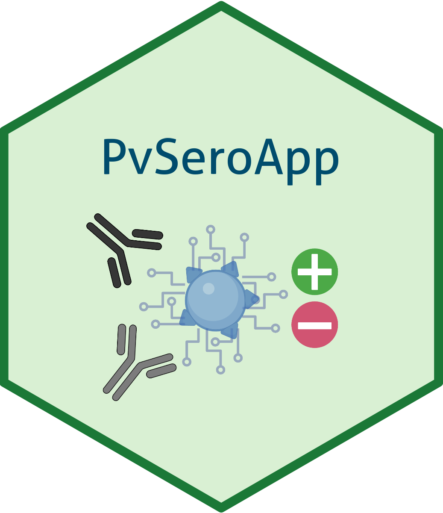
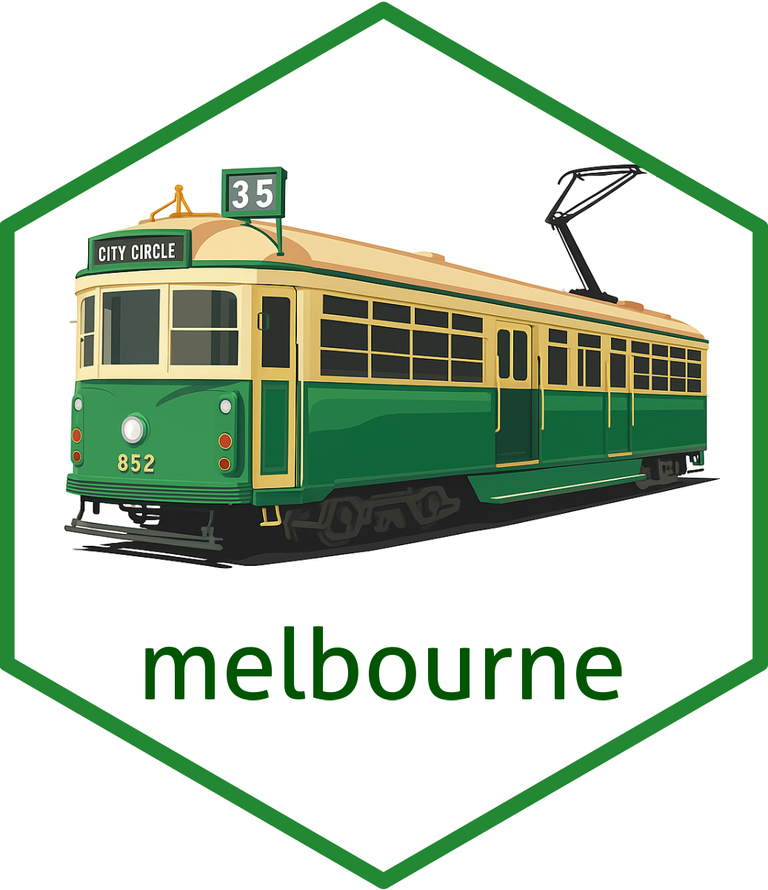

### Hi there 👋

My name is Dionne (she/her; pronounciation: Dee-own) and I completed my **PhD** in the [Day Lab](https://biomedicalsciences.unimelb.edu.au/sbs-research-groups/microbiology-and-immunology-research-groups/day-laboratory-malaria-genomics,-epidemiology-and-control) at the University of Melbourne 🇦🇺🦘 and am currently stationed in the [Mueller Lab](https://www.wehi.edu.au/researcher/ivo-mueller/) at WEHI! 

- 🇦🇺 From Melbourne, AU
- 🎓 BSc (major in Genetics), MSc (BioSciences) and PhD at [The University of Melbourne](https://www.unimelb.edu.au/)
- 💻 Current President of [R-Ladies Melbourne Inc.]([https://twitter.com/rladiesmelb](https://r-ladiesmelbourne.github.io/))
- 💬 Ask me about:
  
      - 🧬 **Population Genetics** and 🔎 **Molecular Epidemiology** of *Plasmodium falciparum*
      - ⚙️ Machine Learning Techniques and Modelling! 
- 📫 You can reach me on [Bluesky](https://bsky.app/profile/dionnecargy.bsky.social), [LinkedIn](https://www.linkedin.com/in/dionne-argyropoulos-47749b14b/) or at my current email address: argyropoulos.d@wehi.edu.au

|  |  |  |
|:---------------------------:|:---------------------------:|:---------------------------:|
| [{PvSeroApp}](https://github.com/dionnecargy/PvSeroApp)| [{SeroTrackR}](https://github.com/dionnecargy/SeroTrackR) | [{melbourne}](https://github.com/dionnecargy/melbourne) |

<!--
**dionnecargy/dionnecargy** is a ✨ _special_ ✨ repository because its `README.md` (this file) appears on your GitHub profile.

Here are some ideas to get you started:

- 🔭 I’m currently working on ...
- 🌱 I’m currently learning ...
- 👯 I’m looking to collaborate on ...
- 🤔 I’m looking for help with ...
- 💬 Ask me about ...
- 📫 How to reach me: ...
- 😄 Pronouns: ...
- ⚡ Fun fact: ...
-->

